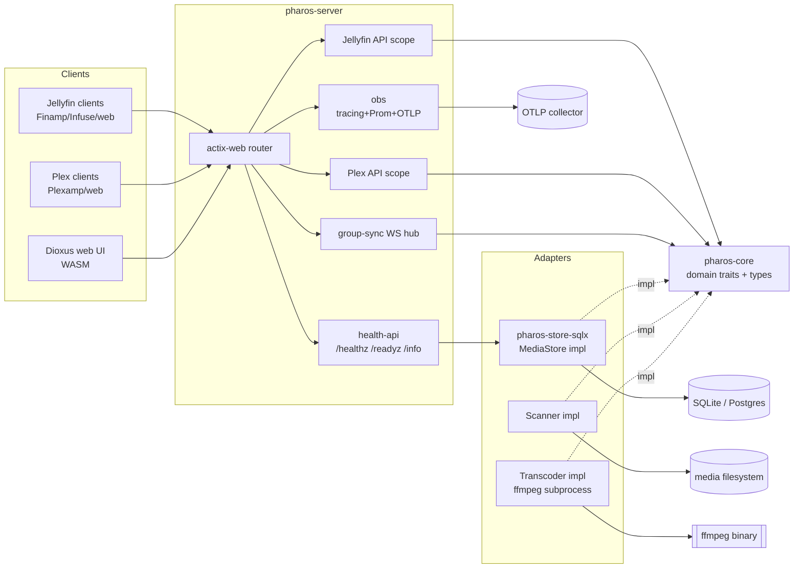
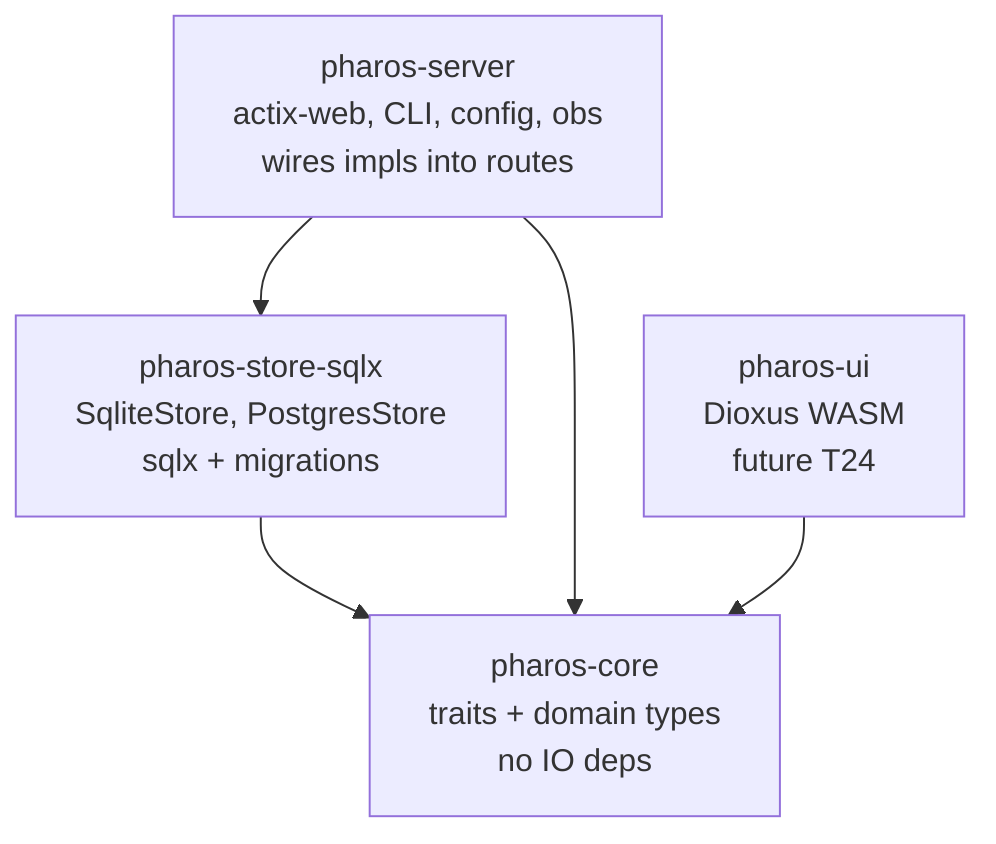
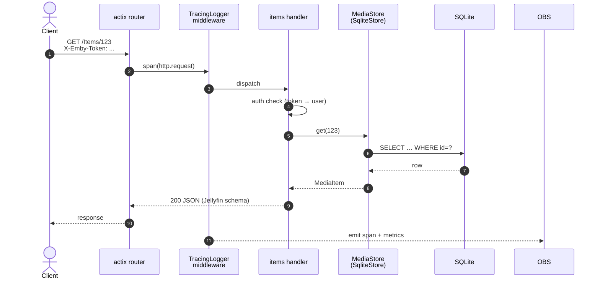
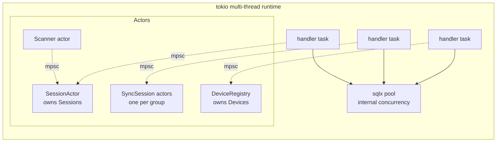
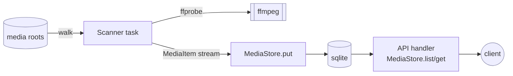

# pharos architecture

Brief, technical. For deeper Jellyfin-mapping rationale see [`jellyfin-mapping.md`](jellyfin-mapping.md).

## 1. Component overview

Solid arrows = runtime data path. Dashed = trait impl-of relationship. All adapters depend on `pharos-core` traits only (V12).

## 2. Crate graph

Direction = `depends-on`. `pharos-core` has zero IO deps so domain logic is testable without DB/fs/network.

## 3. Request flow — Jellyfin `GET /Items/{id}`

Per V13: every inbound request gets a trace span; every store call gets a child span. Per V7: response shape matches Jellyfin schema byte-equivalent.

## 4. Concurrency model

Rules (V18):
- Mutable runtime state owned by exactly one task. Handlers send `mpsc::Sender<Msg>` messages — never lock shared state.
- `sqlx::Pool` is the exception — it's lock-free internally and acts as its own concurrency primitive.
- One-shot init (obs, config) uses `OnceLock` / `Once`. No `Mutex` on request path.

## 5. Data flow — scan → store → serve

Per V5: scan runs in dedicated task pool; never blocks handler tasks. Per V10: each `put` is atomic — readers never see partial entries.

## 6. Boundary summary

| Boundary | Mechanism | Invariant |
|---|---|---|
| HTTP ingress | actix scope + TracingLogger | V4 (no panic), V13 (trace) |
| Domain ↔ IO | `pharos-core` traits, adapter crates | V12 |
| Cross-task state | tokio mpsc, actor pattern | V18 |
| Process ↔ ffmpeg | subprocess + structured stdout/stderr | V6 (no crash propagation) |
| Process ↔ logs | `tracing` crate only | V15 |
| Process ↔ metrics | `metrics` + Prometheus exporter | V14 |
| Filesystem ↔ HTTP | path canonicalization + auth gate | V9 (no traversal) |

Read this table alongside SPEC.md §V when reviewing a change — the table tells you which invariants any given boundary must preserve.
