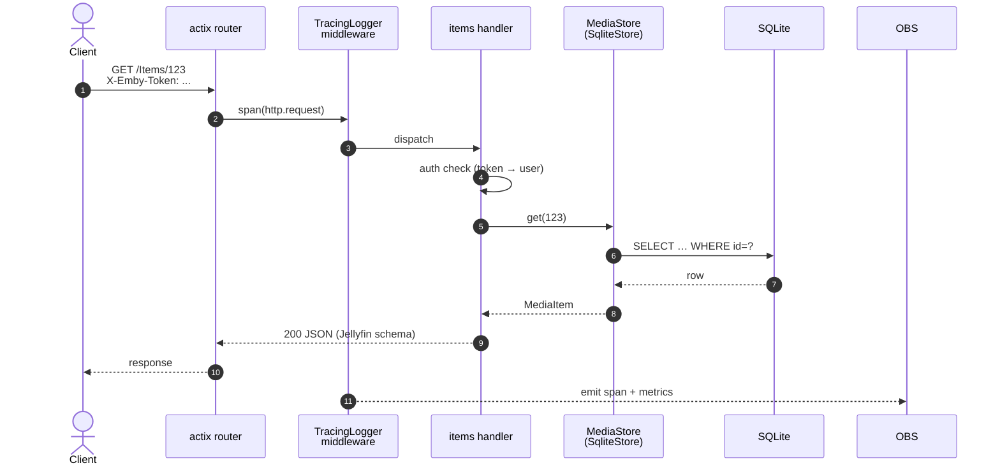
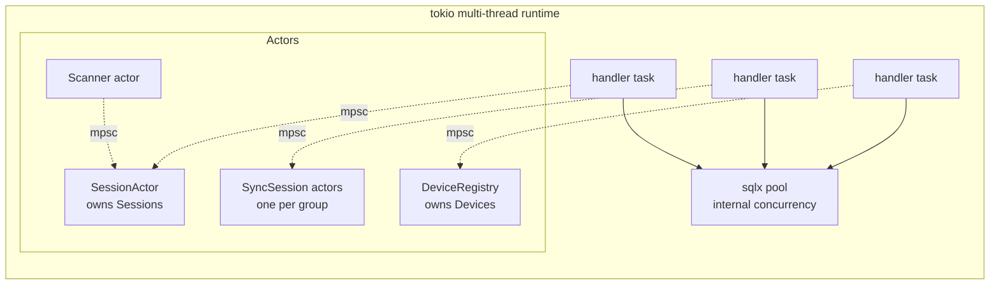

# pharos architecture

Brief, technical. For deeper Jellyfin-mapping rationale see [`jellyfin-mapping.md`](jellyfin-mapping.md).

## 1. Component overview

*Source: [`docs/diagrams/architecture-components.d2`](diagrams/architecture-components.d2) — re-render with `just diagrams` (or `nix run nixpkgs#d2 -- docs/diagrams/architecture-components.d2 docs/diagrams/architecture-components.svg`).*

Solid arrows = runtime data path. Dashed = trait impl-of relationship. All
adapters depend on `pharos-core` traits only (V12).

Notes:

- The only implemented client API is **Jellyfin** (ADR-0001). A Plex
  projection is a backlog vision (`docs/library-backlog.md`), not a component.
- Transcode is **hybrid** (ADR-0004): high-frequency tiny ops (probe, poster,
  trickplay tiles, subtitle convert, waveform) run on a persistent,
  crash-isolated libav `transcode-worker` pool; video-segment/live transcodes
  always fork the `ffmpeg` binary.
- With Postgres, **two server pods can overlap** during a rolling deploy;
  SyncPlay group ownership is coordinated per-group via advisory locks and a
  NOTIFY bus (ADR-0015/0016).

## 2. Crate graph

*Source: [`docs/diagrams/crate-graph.d2`](diagrams/crate-graph.d2) — re-render with `just diagrams` (or `nix run nixpkgs#d2 -- docs/diagrams/crate-graph.d2 docs/diagrams/crate-graph.svg`).*

Direction = `depends-on`. `pharos-core` has zero IO deps so domain logic is
testable without DB/fs/network. `pharos-ui` is deliberately dependency-free
within the workspace (wasm32 target; no workspace-hack) and speaks to the
server over HTTP only. A `workspace-hack` crate (cargo-hakari) unifies
feature-resolution across the native crates.

## 3. Request flow — Jellyfin `GET /Items/{id}`

Per V13: every inbound request gets a trace span; every store call gets a child span. Per V7: response shape matches Jellyfin schema byte-equivalent.

## 4. Concurrency model

Rules (V18):
- Mutable runtime state owned by exactly one task. Handlers send `mpsc::Sender<Msg>` messages — never lock shared state.
- `sqlx::Pool` is the exception — it's lock-free internally and acts as its own concurrency primitive.
- One-shot init (obs, config) uses `OnceLock` / `Once`. No `Mutex` on request path.
- `tokio::sync::Semaphore` is a sanctioned primitive for *capacity* (not state): the CPU/GPU transcode permits and the adaptive `bg_io` gate (ADR-0017).
- The SyncPlay group actors live in `pharos-sync` (`GroupRegistry` → one task per group); with Postgres, group ownership spans replicas via advisory locks (ADR-0016).

## 5. Data flow — scan → store → serve

*Source: [`docs/diagrams/scan-flow.d2`](diagrams/scan-flow.d2) — re-render with `just diagrams` (or `nix run nixpkgs#d2 -- docs/diagrams/scan-flow.d2 docs/diagrams/scan-flow.svg`).*

Per V5: scan runs in dedicated task pool; never blocks handler tasks. Per V10:
each `put` is atomic — readers never see partial entries. Every background
whole-file read (scan probes, subtitle warming, trickplay generation) acquires
the shared adaptive `bg_io` semaphore, which parks to one permit while anyone
is streaming (ADR-0017).

## 6. Boundary summary

| Boundary | Mechanism | Invariant |
|---|---|---|
| HTTP ingress | actix scope + TracingLogger | V4 (no panic), V13 (trace) |
| Domain ↔ IO | `pharos-core` traits, adapter crates | V12 |
| Cross-task state | tokio mpsc, actor pattern | V18 |
| Process ↔ libav | crash-isolated `transcode-worker` subprocess pool (ADR-0004) | V6 (no crash propagation) |
| Process ↔ ffmpeg | subprocess + structured stdout/stderr | V6 (no crash propagation) |
| Background I/O ↔ playback | shared adaptive `bg_io` semaphore (ADR-0017) | playback never starved |
| Replica ↔ replica | per-group advisory lock + NOTIFY bus (ADR-0016) | V25 |
| Process ↔ logs | `tracing` crate only | V15 |
| Process ↔ metrics | `metrics` + Prometheus exporter | V14 |
| Filesystem ↔ HTTP | path canonicalization + auth gate | V9 (no traversal) |

Read this table alongside SPEC.md §V when reviewing a change — the table tells you which invariants any given boundary must preserve.
