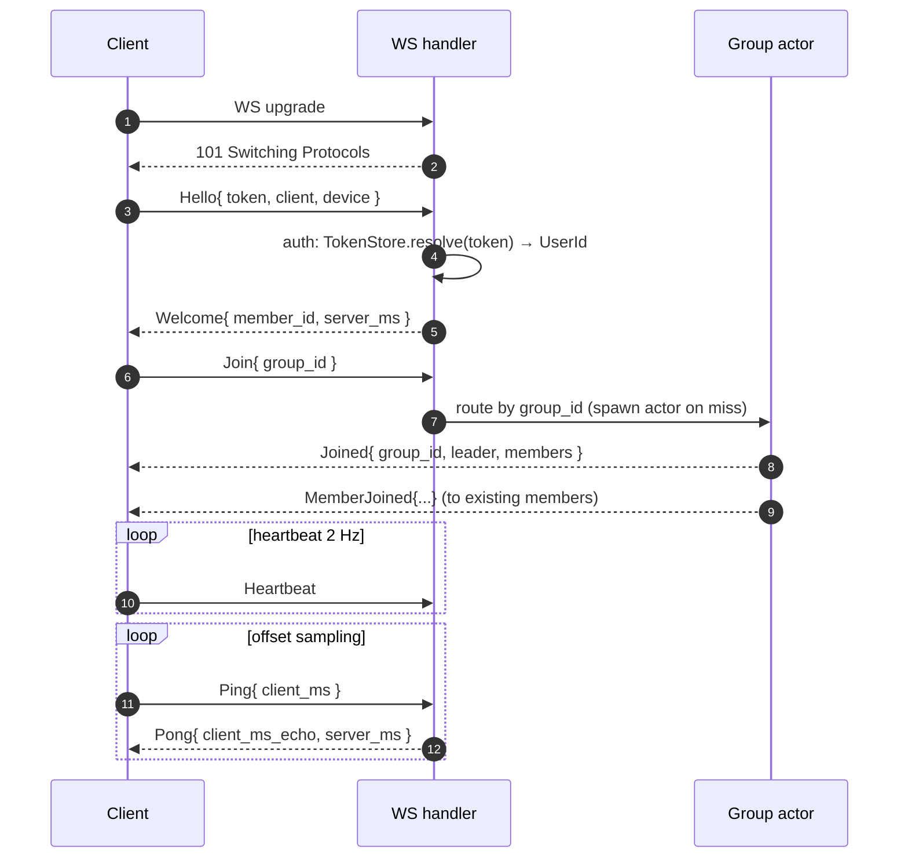
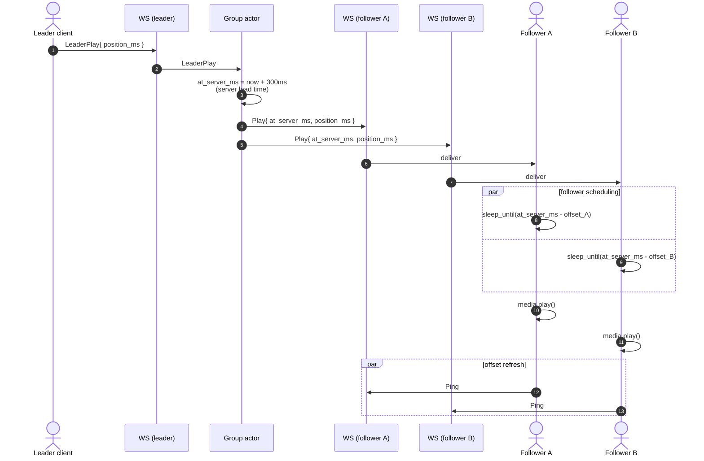

# group-sync protocol

Concrete design for synchronized playback across clients in a group. Drives T16 (impl) and T17 (client wiring). Governing invariants: V3 (≤500 ms p95 sync drift), V18 (actor-owned mutable state), V8 (no token leak in handshake), V19 (must improve on Jellyfin SyncPlay failure modes), V20 (Jellyfin wire-compat).

> **Compatibility note (2026-05-26):** existing Jellyfin phone and TV clients are first-class targets. The Jellyfin-shaped socket described in §10 below is the canonical entry — those clients work unmodified. The richer protocol in §3–§7 is an *extended* path mounted at `/sync/v1/ws` for pharos-native (Dioxus) clients. Server actor is the same for both; only the framing differs.

> **As-built note (2026-07-13):** this is the *design-time* document. The
> implementation kept the core (actor per group, NTP-style offset, server-clock
> scheduling, Jellyfin translation layer) but production hardening changed
> several specifics — **§12 below is the delta list and wins over §2/§7 where
> they disagree.** Durability + multi-replica distribution are covered by
> [ADR-0016](adr/0016-syncplay-durability-distribution.md).

See [`jellyfin-mapping.md`](jellyfin-mapping.md) §5 for the C# SyncPlay → Rust translation rationale, and [`architecture.md`](architecture.md) §4 for the surrounding concurrency model.

## 1. Goal

A leader emits playback intent (play, pause, seek). Followers apply the intent at the same server-clock instant so the audio waveforms line up within human-imperceptible drift. Target: 500 ms p95 across all active followers, measured server-side via heartbeat round trips.

Non-goals (Phase 1): cross-server federation, group voice chat, in-protocol DRM negotiation, sub-frame video sync (target is audio-track alignment).

## 2. Transport

- One WebSocket per client, mounted at `GET /sync/v1/ws` (Jellyfin clients) and `GET /:/sync/v1/ws` (Plex clients).
- Frames are text JSON for v1. Binary CBOR / msgpack is an option for v2 — see §8.
- Heartbeat at 2 Hz (every 500 ms). Three missed heartbeats → server closes the connection and informs the group actor.

## 3. Message shapes

Rust-flavored pseudo-definition (canonical wire form is JSON with snake_case keys):

```rust
enum ClientMsg {
    Hello { token: SecretString, client: String, device_id: String },
    Join { group_id: GroupId },
    Leave,
    Ping { client_ms: u64 },
    Pong { client_ms: u64, server_ms_observed: u64 },
    BufferingStart { position_ms: u64 },
    BufferingEnd  { position_ms: u64 },
    Heartbeat,
}

enum ServerMsg {
    Welcome  { member_id: MemberId, server_ms: u64 },
    Joined   { group_id: GroupId, leader: MemberId, members: Vec<MemberSummary> },
    Pong     { client_ms_echo: u64, server_ms: u64 },
    Play     { at_server_ms: u64, position_ms: u64 },
    Pause    { at_server_ms: u64 },
    Seek     { at_server_ms: u64, position_ms: u64 },
    LeaderChange { leader: MemberId },
    MemberJoined  { member: MemberSummary },
    MemberLeft    { member_id: MemberId },
    Error    { code: ErrorCode, detail: String },
}
```

- Server-emitted timestamps (`server_ms`, `at_server_ms`) come from a single monotonic `Instant::now()` on the server-side actor, converted to a u64 millisecond reference attached at process start. Followers schedule the local action at `at_server_ms - offset`.
- Token in `Hello` is `SecretString` (V8). It is consumed by handshake-side auth and dropped before the actor inbox sees the message, so it never appears in trace fields or logs.
- `Welcome` is the only message followers receive without first sending a `Hello`. The server may close immediately if `Hello` fails auth.

## 4. Clock offset estimation (drift correction)

Standard 4-timestamp NTP-style round trip:

```
T1 (client send Ping  with client_ms)
T2 (server recv at server_ms_recv)
T3 (server reply Pong with server_ms_send)
T4 (client recv at client_ms_recv)

offset_estimate = ((T2 - T1) + (T3 - T4)) / 2
rtt            = (T4 - T1) - (T3 - T2)
```

- Each client runs **N = 9** samples on join, then 1 sample every 2 s.
- Sliding window keeps the latest 9 samples per client. Offset published to the group actor is the **median**, not the mean — kills jitter spikes.
- Followers schedule `Play { at_server_ms }` via `tokio::time::sleep_until(local_at)` where `local_at = local_now + (at_server_ms - server_ms_now)`.

V3 is verifiable: server tags every outbound command with `at_server_ms` and the median observed RTT across followers. If `(at_server_ms - server_ms_send) - max_observed_rtt/2 < 0`, the command is in the past for some follower — server should reject the leader's intent or extend the lead time. The actor enforces a minimum 200 ms scheduling lead.

## 5. Connection lifecycle



- A failed `Hello` drops the connection with `Error { code: AuthFailed, detail }` then 1008 close.
- Reaching the group actor is via `HashMap<GroupId, mpsc::Sender<GroupMsg>>` owned by a `GroupRegistry` task. WS handlers send via the sender; group actors hold `HashMap<MemberId, mpsc::Sender<ServerMsg>>` for fan-out.

## 6. Play propagation sequence



If a follower's measured offset would put `at_server_ms` in its past at receive time, it sends `BufferingStart` immediately. The server actor records it and may emit a corrective `Pause` to the whole group until that follower reports `BufferingEnd`.

## 7. Failure handling

| Failure | Detection | Recovery |
|---|---|---|
| Client WS drops mid-playback | server hits 3 missed heartbeats | actor removes member, broadcasts `MemberLeft`. If member was leader → §7.1 |
| Member buffers > 1 s | `BufferingStart` without `BufferingEnd` in 1 s | actor broadcasts `Pause` to all; resumes when buffering ends |
| Network blip <100 ms | TCP layer handles | no protocol event |
| Server actor panic | parent task supervises via `JoinHandle`; restart with empty state | members re-join via `Join` cycle; positions resynced from leader after reconnect |
| Leader leaves | as above | §7.1 |

### 7.1 Leader handoff

Deterministic election: the next leader is the active member with the lowest `MemberId` (UUIDv4 compared lexicographically). No voting protocol needed. Server emits `LeaderChange { leader }`. Clients display the new leader badge.

Pinning rule (Phase 2 candidate): a client may request `pin_leader=true` in `Join`; the actor honors it unless that client disconnects.

## 8. Open questions (tracked, not blocking T16)

- **Wire format**: v1 = JSON. v2 candidate = CBOR (smaller; `sonic-rs` doesn't help CBOR — would shop for `ciborium` or `minicbor`). Decide once T16 has a working baseline.
- **Clock sampling rate trade-off**: 2 s interval gives ~9 samples in 18 s of joining. Tighter sampling (500 ms) improves convergence but doubles control traffic. Revisit if V3 p95 misses under real-world latency.
- **Multi-leader rules**: Phase 1 is single-leader. If Phase 2 needs two-party DJ mode, the schema needs `LeaderSet` instead of `Leader`. Defer.
- **Server lead time**: hard-coded to 300 ms. Could adapt to observed RTT distribution. Adapt only if V3 fails on slow links.
- **Cross-server federation**: explicitly out of scope.

## 10. Jellyfin wire-compat path

The Jellyfin reference client uses Jellyfin's SyncPlay protocol over the main `/socket` WebSocket (multiplexed with other messages). To keep unmodified clients working (V20):

- Mount the Jellyfin-shaped messages on the existing `/socket` endpoint, multiplexed by the `MessageType` field already used by Jellyfin's socket protocol.
- Recognized inbound types (subset relevant here): `SyncPlayJoinGroup`, `SyncPlayLeaveGroup`, `SyncPlayPlay`, `SyncPlayPause`, `SyncPlaySeek`, `SyncPlayBuffering`, `SyncPlayPing`.
- Outbound types: `SyncPlayGroupUpdate`, `SyncPlayCommand`, `SyncPlayPong`.
- The translation layer maps each Jellyfin message to/from the internal `ClientMsg`/`ServerMsg` enums used by the actor. The actor never sees Jellyfin shapes directly — keeps the algorithm reusable.
- Pharos's improved behaviour (per-member offset, isolated buffering, deterministic handoff) is the **server algorithm**, which is shared by both wire formats. Jellyfin clients benefit even without code changes on their side.

What pharos cannot do over the Jellyfin path:
- Send richer member-state metadata (Jellyfin shape is fixed).
- Negotiate alternative wire encodings (CBOR etc.) — Jellyfin is JSON-only.
- Per-member arbitrary pause-vetoes — Jellyfin clients don't surface a UI for it.

Those features land on the extended `/sync/v1/ws` path for Dioxus and other pharos-aware clients. Both paths route through the same group actor; the actor only sees `ClientMsg`/`ServerMsg`.

## 11. Where each invariant lives

| Invariant | Implementation hook |
|---|---|
| V3 (≤500 ms p95 sync drift) | Server lead time + median offset estimate; failure check at `LeaderPlay` ingest |
| V8 (no token leak) | `SecretString` in `Hello`; consumed pre-actor |
| V18 (actor-owned state) | One tokio task per group; mpsc inbox; member sinks owned by actor |
| V4 (no panic from handler) | WS handler returns `Result<_, actix_ws::Error>`; surface via `Error` frame, not panic |
| V19 (improve on Jellyfin failure modes) | Per-member offset; one corrective Pause cap on leader handoff; auto-reconverge after <2 s blip without rejoin |
| V20 (Jellyfin wire-compat) | Translation layer on `/socket`; actor untouched (§10) |

## 12. As-built deltas (2026-07-13)

What production hardening changed vs the design above. Authoritative detail:
`SPEC.md` §V (V21, V25) + §B (B9, B24–B33) and ADR-0016.

- **Member identity is deterministic** — UUIDv5 derived from the client
  `deviceId` (`hub.rs`), not a fresh UUIDv4 per connection. Same device ⇒ same
  member across reconnects *and process restarts*; every recovery path builds
  on this. §7.1's "lowest MemberId" election was replaced: the **leader is the
  first joiner**, and election re-runs only when a member joins an empty group.
- **Groups are durable** — every mutation snapshots to the `sync_groups` table
  (`GroupPersistence`); on `/socket` connect with no in-memory membership the
  server recovers from the snapshot and resyncs the client. Never-joined groups
  dissolve after 120s; snapshots older than 48h are janitored; ghost members
  are pruned by a ping-fed TTL (150s, fed by the socket `KeepAlive`).
- **Multi-replica** — one owning replica per group, elected via Postgres
  advisory lock; non-owners hold bus-forwarding remote handles (NOTIFY), with
  same-replica members delivered directly. Boot reconciliation re-adopts
  persisted groups with retries until ownership is confirmed.
- **Readiness gate replaces the naive buffering rule.** §7's "buffering > 1 s
  → corrective group Pause" is not what shipped: jellyfin-web ACKs (`Ready`)
  only on an actual player transition, so the server must **never withhold the
  command that causes the transition** (SPEC V21/B9). Unpause of a
  non-buffering group broadcasts immediately; Seek broadcasts at gate entry
  and gates only the resume; gates carry a 30s anti-wedge timeout and honour
  `SetIgnoreWait`. A buffering *freeze* auto-resumes when the last straggler
  reports ready. Every `Pause` carries `PositionTicks` (a positionless Pause
  makes jellyfin-web seek to 0:00).
- **No group command is silently dropped** — a command from a session with no
  recoverable group answers `NotInGroup`; `LeaveGroup` always ACKs `GroupLeft`
  (V25).
- **jellyfin-web transport reality:** commands arrive over **HTTP POST**
  (`/SyncPlay/Pause`, `/SyncPlay/Unpause`, `/SyncPlay/Seek`, `/SyncPlay/Ready`,
  `/SyncPlay/Ping`, …) — the `/socket` WebSocket is effectively *server→client
  only* for SyncPlay (`SyncPlayCommand`/`SyncPlayGroupUpdate` out, `KeepAlive`
  in). §10's inbound `SyncPlayPlay`-style socket messages exist but stock
  jellyfin-web doesn't send them; an HTTP bridge feeds the same actor.
- **The extended `/sync/v1/ws` path** remains available for pharos-native
  clients as designed; the Plex mount (`/:/sync/v1/ws`) never shipped.
